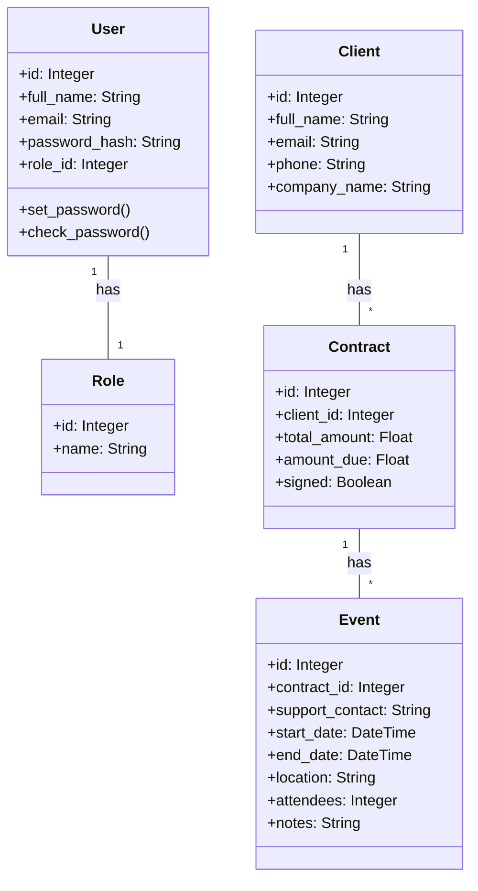

# Epic Events CRM

A secure CLI application for managing client relationships, contracts, and events.

## Setup

1. Clone the repository
```bash
git clone <repository-url>
cd epic-events-cli
```

2. Create and activate virtual environment:
```bash
python -m venv env
source env/bin/activate  # On macOS/Linux
```

3. Install dependencies:
```bash
pip install -r requirements.txt
```

4. Environment Setup:

1. Copy the environment template:
```bash
cp .env.template .env
```

2. Generate a secure JWT key:
```bash
python -c "import secrets; print(secrets.token_urlsafe(32))"
```

3. Update `.env` with:
- Your generated JWT key
- Your Sentry DSN
- Appropriate database URL

5. Initialize database:
```bash
python init_db.py
```

## Database Schema

- Users (id, full_name, email, password_hash, role_id)
- Roles (id, name)
- Clients (id, full_name, email, phone, company_name)
- Contracts (id, client_id, total_amount, amount_due, signed)
- Events (id, contract_id, support_contact, start_date, end_date, location, attendees)

## Class Diagram



## Usage

First login:
```bash
python -m epic_events.cli login <email> <password>
```

Default admin credentials:
- Email: mail
- Password: 12345

### Authentication
```bash
# Login (required before other operations)
python -m epic_events.cli login <email> <password>

# Logout
python -m epic_events.cli logout
```

### Client Operations
```bash
# List all clients
python -m epic_events.cli list-clients

# Add new client (Commercial/Admin only)
python -m epic_events.cli add-new-client
```

### Contract Operations
```bash
# List contracts
python -m epic_events.cli list-contracts

# Add contract (Commercial/Admin only)
python -m epic_events.cli add-new-contract
```

### Event Operations
```bash
# List events
python -m epic_events.cli list-events

# Filter events
python -m epic_events.cli filter-events --location "Paris"
```

## Error Tracking

Sentry integration monitors:
- All unexpected exceptions
- User creation/modification events
- Contract signature events
- Performance metrics

## Security

- All sensitive data stored in .env
- Passwords hashed with bcrypt
- Role-based access control
- No sensitive data in version control

## Role Permissions
- Admin: Full access
- Commercial: Client and contract management
- Support: Event management
- Gestion: Contract and event oversight

| Operation              | Admin (1) | Commercial (2)| Support (3) | Gestion (4) |
|------------------------|:---------:|:-------------:|:-----------:|:-----------:|
| User Management        |     ✅    |       ❌       |     ❌      |     ❌      |
| Create Clients         |     ✅    |       ✅       |     ❌      |     ❌      |
| View Clients           |     ✅    |       ✅       |     ✅      |     ✅      |
| Update Clients         |     ✅    |       ✅       |     ❌      |     ❌      |
| Create Contracts       |     ✅    |       ✅       |     ❌      |     ❌      |
| View Contracts         |     ✅    |       ✅       |     ✅      |     ✅      |
| Update Contracts       |     ✅    |       ✅       |     ❌      |     ✅      |
| Create Events          |     ✅    |       ❌       |     ❌      |     ✅      |
| View Events            |     ✅    |       ✅       |     ✅      |     ✅      |
| Update Events          |     ✅    |       ❌       |     ✅      |     ✅      |
| View Reports           |     ✅    |       ✅       |     ✅      |     ✅      |

Note: Numbers in parentheses represent role_id in the database.


## Test Data Generation

To populate the database with sample data:

```bash
# Install all requirements (includes Faker)
pip install -r requirements.txt

# Generate test data
python seed_test_data.py
```

This will create:
- 5 clients with French localized data
- 1-3 contracts per client
- 1-5 events per contract

## Project Structure

```
epic_events/
├── cli.py          # Command-line interface
├── config.py       # Configuration and Sentry setup
├── models.py       # Database models
├── crud.py         # Database operations
├── auth.py         # Authentication logic
└── utils.py        # Utility functions
```

## Contributing

1. Fork the repository
2. Create a feature branch
3. Submit a pull request

## License

This project is licensed under the MIT License.